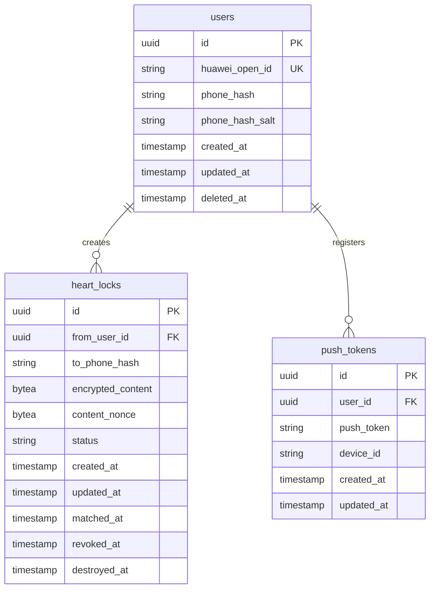

# 文档信息

| 字段 | 内容 |
|---|---|
| 文档名称 | HeartLock（心锁）数据库设计 |
| 文档编号 | DB-V1.0 |
| 状态 | 草稿 |
| 作者 | Codex |
| 创建日期 | 2026-07-07 |
| 最后更新 | 2026-07-07 |

---

## 1. Purpose（目的）

定义 HeartLock（心锁）的数据库表结构、字段说明、索引策略和数据安全方案，为后端开发提供精确的数据层参考。

---

## 2. Scope（范围）

涵盖用户表、心锁表、Push Token 表的核心设计，以及加密方案、哈希方案和备份策略。

---

## 3. Definitions（术语）

| 术语 | 定义 |
|---|---|
| 手机号指纹 | 对用户手机号进行 bcrypt 加盐哈希后得到的标识字符串 |
| 加密内容 | 使用 AES-256-GCM 对心锁文字加密后的密文 |
| 数据密钥 | 用于加密心锁内容的对称密钥 |
| 主密钥 | 用于加密数据密钥的根密钥 |

---

## 4. Database Schema（数据库设计）

### 4.1 技术选型

- 数据库：PostgreSQL 16+
- 字符集：UTF-8
- 引擎：InnoDB 兼容 / PostgreSQL 默认存储引擎

### 4.2 实体关系概览



### 4.3 表定义

#### 4.3.1 users（用户表）

| 字段名 | 类型 | 约束 | 说明 |
|---|---|---|---|
| id | UUID | PK, DEFAULT gen_random_uuid() | 用户唯一标识 |
| huawei_open_id | VARCHAR(128) | NOT NULL, UNIQUE | 华为账号 OpenID |
| phone_hash | VARCHAR(255) | NOT NULL, UNIQUE | bcrypt(phone + salt) |
| phone_hash_salt | VARCHAR(64) | NOT NULL | bcrypt salt |
| created_at | TIMESTAMPTZ | NOT NULL, DEFAULT NOW() | 注册时间 |
| updated_at | TIMESTAMPTZ | NOT NULL, DEFAULT NOW() | 更新时间 |
| deleted_at | TIMESTAMPTZ | DEFAULT NULL | 注销时间（软删除标记用，不提供恢复） |

**索引：**

```sql
CREATE UNIQUE INDEX idx_users_huawei_open_id ON users(huawei_open_id);
CREATE UNIQUE INDEX idx_users_phone_hash ON users(phone_hash);
```

**说明：**

- phone_hash 是整个系统的核心标识。它既是用户的唯一标识，也是匹配检测的关键字段。
- 明文手机号永不落盘。
- deleted_at 仅在注销到彻底清理前的短暂窗口期内存在（清理后记录真实删除），不作为业务逻辑依赖。

#### 4.3.2 heart_locks（心锁表）

| 字段名 | 类型 | 约束 | 说明 |
|---|---|---|---|
| id | UUID | PK, DEFAULT gen_random_uuid() | 心锁唯一标识 |
| from_user_id | UUID | NOT NULL, FK -> users.id | 创建者用户 ID |
| to_phone_hash | VARCHAR(255) | NOT NULL | 目标用户的手机号指纹 |
| encrypted_content | BYTEA | -- | AES-256-GCM 加密内容（可为 NULL） |
| content_nonce | BYTEA | -- | AES-GCM 加密使用的 nonce |
| status | VARCHAR(20) | NOT NULL, DEFAULT 'WAITING' | 状态：WAITING / MATCHED / REVOKED / DESTROYED |
| created_at | TIMESTAMPTZ | NOT NULL, DEFAULT NOW() | 创建时间 |
| updated_at | TIMESTAMPTZ | NOT NULL, DEFAULT NOW() | 最后更新时间 |
| matched_at | TIMESTAMPTZ | DEFAULT NULL | 匹配成功时间 |
| revoked_at | TIMESTAMPTZ | DEFAULT NULL | 撤回时间 |
| destroyed_at | TIMESTAMPTZ | DEFAULT NULL | 永久删除时间 |

**索引：**

```sql
CREATE INDEX idx_heart_locks_from_user ON heart_locks(from_user_id);
CREATE INDEX idx_heart_locks_to_phone_hash ON heart_locks(to_phone_hash);
CREATE UNIQUE INDEX idx_heart_locks_from_to_unique ON heart_locks(from_user_id, to_phone_hash);
CREATE INDEX idx_heart_locks_match_check ON heart_locks(from_user_id, to_phone_hash, status)
    WHERE status = 'WAITING';
```

**说明：**

- `encrypted_content` 在状态为 REVOKED 时保留内容，在 DESTROYED 时设为 NULL。
- `idx_heart_locks_from_to_unique` 保证同一用户对同一目标手机号只能有一条记录（RULE-010）。
- `idx_heart_locks_match_check` 是匹配检测的性能关键索引。
- `matched_at` 要求两条匹配记录的该字段值相同（精确到毫秒）。

#### 4.3.3 push_tokens（推送 Token 表）

| 字段名 | 类型 | 约束 | 说明 |
|---|---|---|---|
| id | UUID | PK, DEFAULT gen_random_uuid() | 记录 ID |
| user_id | UUID | NOT NULL, FK -> users.id | 用户 ID |
| push_token | VARCHAR(512) | NOT NULL | 华为推送 Token |
| device_id | VARCHAR(128) | NOT NULL | 设备唯一标识 |
| created_at | TIMESTAMPTZ | NOT NULL, DEFAULT NOW() | 创建时间 |
| updated_at | TIMESTAMPTZ | NOT NULL, DEFAULT NOW() | 更新时间 |

**索引：**

```sql
CREATE INDEX idx_push_tokens_user ON push_tokens(user_id);
CREATE UNIQUE INDEX idx_push_tokens_device ON push_tokens(user_id, device_id);
```

### 4.4 加密方案

#### 4.4.1 心锁内容加密

```
加密流程:
1. 生成随机 AES-256 密钥 (32 bytes)
2. 生成随机 nonce (12 bytes for GCM)
3. AES-256-GCM 加密明文内容
4. 数据密钥使用主密钥加密后存储到密钥管理服务
5. ciphertext + nonce 存入 heart_locks 表

解密流程:
1. 从密钥管理服务解密数据密钥
2. 从 heart_locks 读取 ciphertext + nonce
3. AES-256-GCM 解密密文
```

#### 4.4.2 手机号哈希方案

```
哈希流程:
1. 生成随机 bcrypt salt (cost=12)
2. phone_hash = bcrypt(phone_number + salt, cost=12)
3. phone_hash + salt 存入 users 表

匹配检测:
1. 使用创建者提供的目标手机号明文
2. 使用相同算法计算 phone_hash
3. 在 heart_locks.to_phone_hash 中匹配
```

### 4.5 数据清除策略

| 操作 | 行为 | 时间点 |
|---|---|---|
| 心锁撤回 | 加密内容保留，状态变更 | 立即 |
| 心锁永久删除 | encrypted_content = NULL，元数据保留 | 立即 |
| 心锁元数据清理 | 删除 REVOKED 超过 30 天的元数据 | 30天后定时任务 |
| 账户注销 | 删除 user、heart_locks、push_tokens 所有记录 | 立即 |
| 操作日志 | 保留操作日志 | 7天后定时清除 |

---

## 5. Acceptance Criteria（验收标准）

| 编号 | 验收标准 | 关联规则 |
|---|---|---|
| AC-DB-001 | 同一 (from_user_id, to_phone_hash) 组合只能有一条记录 | RULE-010 |
| AC-DB-002 | 同一用户 WAITING 状态的心锁数 <= 3 | RULE-011 |
| AC-DB-003 | 匹配检测查询响应时间 < 100ms | RULE-033 |
| AC-DB-004 | 加密内容在数据库中以 BYTEA 存储，不可读 | RULE-050 |
| AC-DB-005 | 明文手机号在任何数据库字段中均不可见 | RULE-052 |
| AC-DB-006 | 账户注销后，三张表对应的用户数据全部删除 | RULE-006 |

---

## 6. References（引用）

| 引用 | 说明 |
|---|---|
| [PRD.md](../product/PRD.md) | 产品需求文档 |
| [BusinessRules.md](../product/BusinessRules.md) | 业务规则 |
| [API.md](./API.md) | API 接口规范 |
