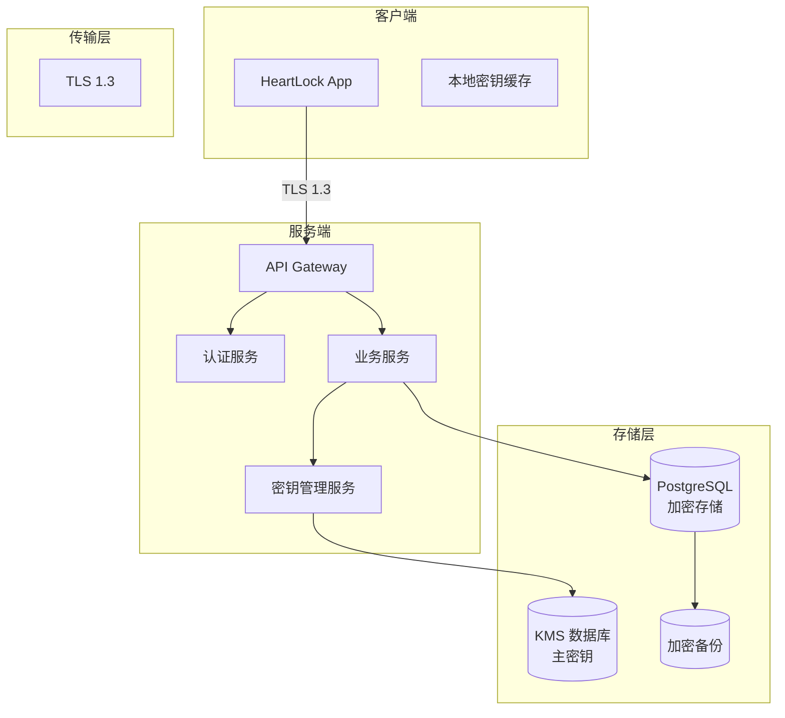
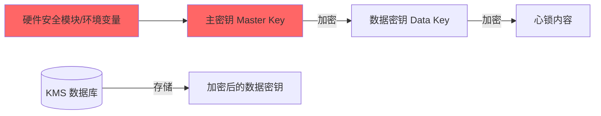

# 文档信息

| 字段 | 内容 |
|---|---|
| 文档名称 | HeartLock（心锁）安全架构 |
| 文档编号 | SEC-V1.1 |
| 状态 | 草稿 |
| 作者 | Codex |
| 创建日期 | 2026-07-07 |
| 最后更新 | 2026-07-07 |

---

## 1. Purpose（目的）

定义 HeartLock（心锁）的端到端安全架构，包括传输安全、存储安全、密钥管理和隐私合规方案，确保用户数据在整个生命周期中受到保护。

---

## 2. Scope（范围）

涵盖网络传输层加密、数据存储加密、密钥管理体系（含主密钥轮换 SOP）、手机号隐私处理、SQL 注入防护、访问控制、审计日志规范、依赖安全扫描和安全事件响应。

---

## 3. Architecture Overview（安全架构概览）



---

## 4. Security Layers（安全分层）

### 4.1 传输安全

**要求：**
- 所有 API 通信强制使用 TLS 1.3
- 证书使用正规 CA 签发，禁用自签名证书
- HSTS 头部配置：max-age=31536000; includeSubDomains

### 4.2 数据存储安全

#### 4.2.1 手机号保护

| 层级 | 方案 | 说明 |
|---|---|---|
| 传输中 | TLS 1.3 | 手机号从客户端到服务端全程加密 |
| 存储中 | bcrypt(cost=12) + random salt | 不可逆哈希，暴力破解成本高 |
| 响应中 | 不返回手机号 | 任何 API 响应都不含明文手机号 |
| 日志中 | 脱敏处理 | 日志中手机号自动脱敏（138****8000） |

#### 4.2.2 心锁内容保护

| 层级 | 方案 | 说明 |
|---|---|---|
| 传输中 | TLS 1.3 | 明文内容客户端到服务端加密传输 |
| 存储中 | AES-256-GCM | 服务端收到后立即加密，密文落盘 |
| 密钥管理 | 主密钥 + 数据密钥双层 | 数据密钥用主密钥加密后独立存储 |

#### 4.2.3 SQL 注入保护

| 层级 | 方案 | 说明 |
|---|---|---|
| 查询方式 | 强制参数化查询 | 所有 SQL 查询必须使用 `database/sql` 参数占位符（`$1`, `$2`），禁止字符串拼接 |
| ORM 使用 | 安全配置 | 如使用 GORM，启用 PrepareStmt 模式，关闭 LogSQL（生产环境） |
| 输入验证 | 中间层过滤 | API 请求验证中间件在 SQL 查询前进行输入格式校验（见 API.md 3.7） |
| 数据库权限 | 最小权限原则 | 应用数据库用户仅具备 CRUD 权限，禁止 DDL 权限（建表、删表） |
| 定期审查 | SQL 审查 | 每次代码审查包含 SQL 注入风险评估 |

### 4.3 密钥管理体系



**主密钥管理：**
- 主密钥存储在独立的密钥管理服务中（或环境变量）
- 任何情况下主密钥不落日志、不入数据库

**数据密钥生命周期：**
1. 创建心锁时：生成随机 AES-256 数据密钥 → 加密内容 → 用主密钥加密数据密钥 → 存储加密后的数据密钥
2. 读取心锁时（MATCHED）：读取加密数据密钥 → 用主密钥解密 → 用数据密钥解密内容
3. 销毁心锁时：删除加密数据密钥（无需解密）

#### 4.3.1 密钥轮换 SOP

**定期轮换（计划性轮换，每 90 天执行一次）：**

| 步骤 | 操作 | 说明 |
|---|---|---|
| 1 | 生成新主密钥 | 新密钥必须使用安全随机数生成器（crypto/rand），密钥强度 256 位 |
| 2 | 更新主密钥存储 | 新密钥写入密钥管理服务，旧密钥标记为"待回收" |
| 3 | 渐进式重加密 | 后台任务逐步读取未销毁的心锁数据密钥，用新主密钥重新加密后更新 |
| 4 | 验证 | 随机抽样验证重加密后的数据密钥可正常解密心锁内容 |
| 5 | 回收旧密钥 | 重加密全部完成后，删除旧密钥 |

**紧急轮换（密钥泄露等安全事件触发，立即执行）：**

| 步骤 | 操作 | 时间要求 |
|---|---|---|
| 1 | 生成新主密钥 | 30 分钟内 |
| 2 | 新密钥生效 | 立即生效，所有新加密使用新密钥 |
| 3 | 全量重加密 | 对所有活跃（非 DESTROYED）心锁的数据密钥进行重新加密 |
| 4 | 安全审查 | 分析泄露原因，确认泄露范围 |
| 5 | 旧密钥彻底删除 | 重加密完成 + 安全审查通过后删除 |

**轮换原则：**
- 轮换期间新旧密钥必须同时有效，确保现有加密数据可解密
- 轮换任务应在业务低峰期执行
- 每次轮换必须记录操作日志（操作人、触发时间、完成时间、涉及数据量）

### 4.4 API 安全

#### 认证机制

```
JWT Token:
- 签发：用户注册/登录时由认证服务签发
- 载荷：{ user_id, iat, exp }
- 签名：HS256 或 RS256
- 有效期：30 天
- 刷新：Token 过期后需重新登录
```

#### 防重放与限流

| 策略 | 配置 |
|---|---|
| API 限流 | 每 IP 每分钟 60 次 |
| 心锁创建限流 | 每用户每小时 10 次 |
| 登录限流 | 每 IP 每小时 20 次 |
| 请求签名 | 可选：HMAC 请求签名 |

### 4.5 数据清除与审计日志

#### 实时删除

| 操作 | 删除内容 | 方式 |
|---|---|---|
| 心锁永久删除 | 加密内容设为 NULL | SQL UPDATE |
| 账户注销 | 用户、心锁、Push Token 记录 | SQL DELETE |

#### 定时清理

| 清理内容 | 保留周期 | 方式 |
|---|---|---|
| REVOKED 元数据 | 30 天 | 定时任务删除 |
| 操作审计日志 | 7 天 | 定时任务清理 |
| 未授权手机号用户 | 90 天 | 定时任务删除 |

#### 4.5.1 审计日志规范

**日志结构（JSON 格式，每行一条）：**

```json
{
  "timestamp": "2026-07-07T10:00:00Z",
  "level": "INFO",
  "action": "heart_lock.create",
  "user_id": "uuid",
  "resource": "heart_lock",
  "resource_id": "uuid",
  "ip_address": "203.0.113.1",
  "request_id": "uuid",
  "latency_ms": 45,
  "detail": {
    "target_phone_prefix": "138****8000"
  }
}
```

**敏感数据脱敏规则：**

| 字段 | 脱敏方式 | 示例 |
|---|---|---|
| 手机号 | 保留前 3 位和后 4 位，中间替换为 **** | 138****8000 |
| 心锁内容 | 仅在 MATCHED 状态解密，日志中不记录解密内容 | — |
| IP 地址 | 完整记录（用于安全审计），但存储时哈希化 | — |

**日志分级：**

| 级别 | 使用场景 |
|---|---|
| INFO | 正常业务操作（注册、创建心锁、匹配） |
| WARN | 异常但不影响功能（如限流触发、请求参数错误） |
| ERROR | 操作失败（数据库错误、加密失败） |
| FATAL | 系统级错误需人工介入（主密钥不可用） |

### 4.6 响应安全配置

```
HTTP 安全头:
X-Content-Type-Options: nosniff
X-Frame-Options: DENY
X-XSS-Protection: 1; mode=block
Strict-Transport-Security: max-age=31536000; includeSubDomains
Content-Security-Policy: default-src 'self'
```


### 4.7 依赖安全扫描

#### 4.7.1 扫描工具

- **Go 依赖**：使用 `govulncheck`（Go 官方漏洞扫描工具）或 `trivy`（通用容器/依赖扫描）
- **扫描频率**：每次 CI 构建时自动扫描
- **扫描范围**：Go Module 依赖（go.mod + go.sum）

#### 4.7.2 扫描策略

| 漏洞等级 | 处理要求 | 阻断构建 |
|---|---|---|
| CRITICAL | 立即修复，24 小时内上线补丁 | 是 |
| HIGH | 3 天内修复 | 是 |
| MEDIUM | 下一个迭代修复 | 否（告警） |
| LOW | 记录追踪 | 否（告警） |

#### 4.7.3 CI 集成

在 GitHub Actions 的 CI 流程中加入：

```yaml
- name: 依赖安全扫描
  uses: aquasecurity/trivy-action@master
  with:
    scan-type: 'fs'
    scan-ref: '.'
    format: 'sarif'
    output: 'trivy-results.sarif'
    severity: 'CRITICAL,HIGH'
```

### 4.8 安全事件响应流程

#### 4.8.1 事件分级

| 级别 | 定义 | 示例 |
|---|---|---|
| P0 | 影响用户数据安全或系统可用性 | 主密钥泄露、数据库被入侵、用户数据被未授权访问 |
| P1 | 影响单个用户或功能模块安全 | Token 伪造、心锁内容被未授权解密 |
| P2 | 潜在安全隐患 | 发现 SQL 注入漏洞但未利用、第三方依赖严重漏洞 |

#### 4.8.2 响应流程

```
检测 → 隔离 → 修复 → 复盘 → 改进

1. 检测
   - 依赖扫描发现漏洞
   - 入侵检测系统告警
   - 用户报告异常

2. 隔离（P0/P1 专案）
   - 立即下线受影响的服务或功能
   - 限制受影响 API 的访问
   - 通知项目负责人

3. 修复
   - 紧急修复：24 小时内发布补丁（P0）
   - 常规修复：下一个部署周期（P1）
   - 记录追踪：下次迭代（P2）

4. 复盘
   - 确认漏洞根因
   - 检查同类风险
   - 更新安全规范和测试用例

5. 改进
   - 更新 Security.md
   - 增加自动化检测
   - 加强开发者安全意识培训
```


---


## 5. Acceptance Criteria（验收标准）

| 编号 | 验收标准 | 关联章节 |
|---|---|---|
| AC-SEC-001 | 所有 API 响应中不包含明文手机号 | 4.2.1 |
| AC-SEC-002 | 数据库查询使用参数化占位符，无字符串拼接 | 4.2.3 |
| AC-SEC-003 | 主密钥每 90 天自动轮换，紧急轮换 30 分钟内完成 | 4.3.1 |
| AC-SEC-004 | CI 构建中依赖扫描阻断 CRITICAL 和 HIGH 漏洞 | 4.7 |
| AC-SEC-005 | 审计日志 7 天后自动清除，日志中不包含敏感数据明文 | 4.5.1 |
| AC-SEC-006 | 安全事件 P0/P1 在 1 小时内启动应急响应 | 4.8 |

---

## 6. Compliance（合规要求）

| 合规项 | 要求 |
|---|---|
| 用户注销权 | 账户注销后数据彻底删除 |
| 数据最小化 | 仅收集实现功能所需的最少数据 |
| 数据告知 | 明确告知用户数据处理方式 |
| 未成年人保护 | 应用市场年龄分级 + 用户声明 |

---

## 7. References（引用）

| 引用 | 说明 |
|---|---|
| [BusinessRules.md](../product/BusinessRules.md) | 业务规则（RULE-050 ~ RULE-055） |
| [Database.md](./Database.md) | 数据库设计与加密方案 |
| [API.md](./API.md) | API 接口规范 |
| [Deployment.md](./Deployment.md) | 部署与运维规范 |
