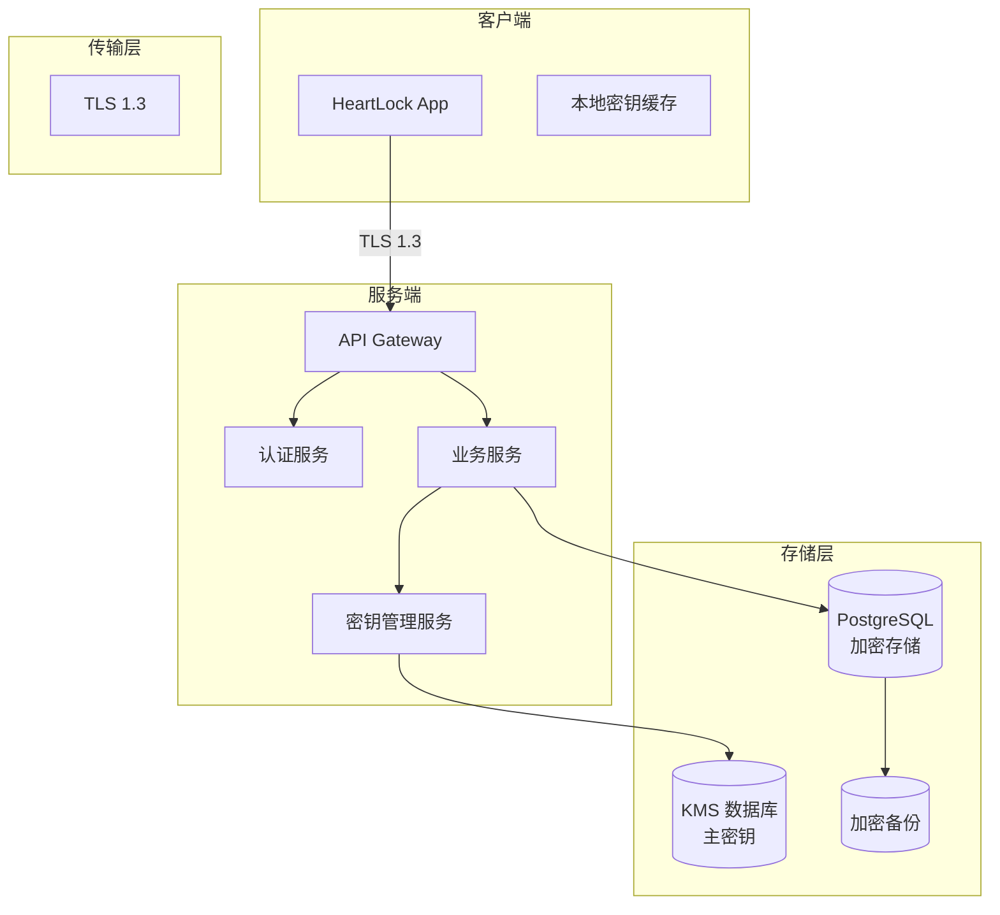
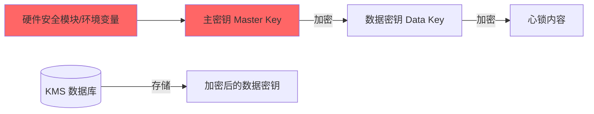

# 文档信息

| 字段 | 内容 |
|---|---|
| 文档名称 | HeartLock（心锁）安全架构 |
| 文档编号 | SEC-V1.0 |
| 状态 | 草稿 |
| 作者 | Codex |
| 创建日期 | 2026-07-07 |
| 最后更新 | 2026-07-07 |

---

## 1. Purpose（目的）

定义 HeartLock（心锁）的端到端安全架构，包括传输安全、存储安全、密钥管理和隐私合规方案，确保用户数据在整个生命周期中受到保护。

---

## 2. Scope（范围）

涵盖网络传输层加密、数据存储加密、密钥管理体系、手机号隐私处理、访问控制和安全审计。

---

## 3. Architecture Overview（安全架构概览）



---

## 4. Security Layers（安全分层）

### 4.1 传输安全

**要求：**
- 所有 API 通信强制使用 TLS 1.3
- 证书使用正规 CA 签发，禁用自签名证书
- HSTS 头部配置：max-age=31536000; includeSubDomains

### 4.2 数据存储安全

#### 4.2.1 手机号保护

| 层级 | 方案 | 说明 |
|---|---|---|
| 传输中 | TLS 1.3 | 手机号从客户端到服务端全程加密 |
| 存储中 | bcrypt(cost=12) + random salt | 不可逆哈希，暴力破解成本高 |
| 响应中 | 不返回手机号 | 任何 API 响应都不含明文手机号 |
| 日志中 | 脱敏处理 | 日志中手机号自动脱敏（138****8000） |

#### 4.2.2 心锁内容保护

| 层级 | 方案 | 说明 |
|---|---|---|
| 传输中 | TLS 1.3 | 明文内容客户端到服务端加密传输 |
| 存储中 | AES-256-GCM | 服务端收到后立即加密，密文落盘 |
| 密钥管理 | 主密钥 + 数据密钥双层 | 数据密钥用主密钥加密后独立存储 |
| 解密条件 | 仅在 MATCHED 状态 | 只有匹配成功后服务端才解密 |

### 4.3 密钥管理体系



**主密钥管理：**
- 主密钥存储在独立的密钥管理服务中（或环境变量）
- 主密钥定期轮换（建议每 90 天）
- 任何情况下主密钥不落日志、不入数据库

**数据密钥生命周期：**
1. 创建心锁时：生成随机 AES-256 数据密钥 → 加密内容 → 用主密钥加密数据密钥 → 存储加密后的数据密钥
2. 读取心锁时（MATCHED）：读取加密数据密钥 → 用主密钥解密 → 用数据密钥解密内容
3. 销毁心锁时：删除加密数据密钥（无需解密）

### 4.4 API 安全

#### 认证机制

```
JWT Token:
- 签发：用户注册/登录时由认证服务签发
- 载荷：{ user_id, iat, exp }
- 签名：HS256 或 RS256
- 有效期：30 天
- 刷新：Token 过期后需重新登录
```

#### 防重放与限流

| 策略 | 配置 |
|---|---|
| API 限流 | 每 IP 每分钟 60 次 |
| 心锁创建限流 | 每用户每小时 10 次 |
| 登录限流 | 每 IP 每小时 20 次 |
| 请求签名 | 可选：HMAC 请求签名 |

### 4.5 数据清除策略

#### 实时删除

| 操作 | 删除内容 | 方式 |
|---|---|---|
| 心锁永久删除 | 加密内容设为 NULL | SQL UPDATE |
| 账户注销 | 用户、心锁、Push Token 记录 | SQL DELETE |

#### 定时清理

| 清理内容 | 保留周期 | 方式 |
|---|---|---|
| REVOKED 元数据 | 30 天 | 定时任务删除 |
| 操作审计日志 | 7 天 | 定时任务清理 |
| 未授权手机号用户 | 90 天 | 定时任务删除 |

### 4.6 响应安全配置

```
HTTP 安全头:
X-Content-Type-Options: nosniff
X-Frame-Options: DENY
X-XSS-Protection: 1; mode=block
Strict-Transport-Security: max-age=31536000; includeSubDomains
Content-Security-Policy: default-src 'self'
```

---

## 5. Compliance（合规要求）

| 合规项 | 要求 |
|---|---|
| 用户注销权 | 账户注销后数据彻底删除 |
| 数据最小化 | 仅收集实现功能所需的最少数据 |
| 数据告知 | 明确告知用户数据处理方式 |
| 未成年人保护 | 应用市场年龄分级 + 用户声明 |

---

## 6. References（引用）

| 引用 | 说明 |
|---|---|
| [BusinessRules.md](../product/BusinessRules.md) | 业务规则（RULE-050 ~ RULE-055） |
| [Database.md](./Database.md) | 数据库设计与加密方案 |
| [API.md](./API.md) | API 接口规范 |
