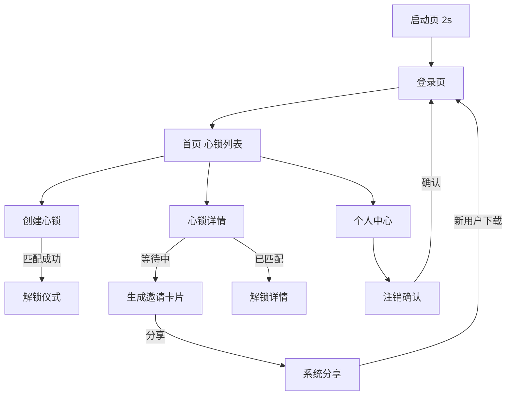

# 文档信息

| 字段 | 内容 |
|---|---|
| 文档名称 | HeartLock（心锁）UI 设计规范 |
| 文档编号 | UI-V1.0 |
| 状态 | 草稿 |
| 平台 | HarmonyOS NEXT (API 12+) |
| 作者 | Codex |
| 创建日期 | 2026-07-07 |
| 最后更新 | 2026-07-07 |

---

## 1. Purpose（目的）

定义 HeartLock（心锁）在 HarmonyOS NEXT 平台上的 UI 设计规范和页面布局，确保实现效果与产品理念一致。

---

## 2. Scope（范围）

涵盖品牌视觉规范、所有页面的布局设计和交互说明，适用于前端设计和开发。

---

## 3. Brand Visual Identity（品牌视觉规范）

### 3.1 色彩体系

**主色调（深色系）：**

| 角色 | 色值 | 用途 |
|---|---|---|
| 背景色 | #0D0D0D | 全局背景、启动页、仪式页 |
| 卡片背景 | #1A1A1A | 列表卡片、弹窗背景 |
| 分割线 | #2A2A2A | 内容分割、边框 |
| 主文案 | #FFFFFF | 标题、一级正文 |
| 二级文案 | rgba(255,255,255,0.6) | 辅助信息、时间戳 |
| 强调色 | #D4A574 (暖金色) | 锁图标、核心按钮、匹配成功 |
| 警示色 | #FF4444 | 确认删除、注销 |
| 禁用色 | rgba(255,255,255,0.2) | 不可用按钮、占位符 |

### 3.2 字体

| 属性 | 值 |
|---|---|
| 中文字体 | HarmonyOS Sans SC |
| 英文字体 | HarmonyOS Sans |
| 一级标题 | 24sp, Bold |
| 二级标题 | 18sp, Medium |
| 正文 | 16sp, Regular |
| 辅助文案 | 13sp, Regular |
| 心锁文字 | 16sp, Regular, 行高 1.6 |

### 3.3 图标与图形

- 锁图标：极简风格，线面结合
- 图标尺寸：24sp / 32sp / 48sp
- 圆角：CornerRadius = 12sp（卡片）/ 8sp（按钮）

### 3.4 品牌词展示

启动页、登录页必须展示以下品牌文字之一：

- **秘密属于一个人，答案属于两个人**（首选 Slogan）
- **所有单向的喜欢，都会永远保密；只有双向的喜欢，才值得被世界知道**

---

## 4. Page Specifications（页面设计）

### 4.1 启动页

| 元素 | 说明 |
|---|---|
| 背景 | 纯黑 (#0D0D0D) |
| 中央 | 锁图标（金色，线面风格） |
| 下方 | Slogan：秘密属于一个人，答案属于两个人 |
| 显示时间 | 2 秒后自动进入登录页 |
| 动效 | 锁图标淡入（500ms），Slogan 再淡入（500ms） |

### 4.2 登录页

| 元素 | 说明 |
|---|---|
| 背景 | 深色渐变（#0D0D0D → #1A1A1A） |
| 顶部 | 心锁 Logo + App 名称 |
| 中部 | Slogan 展示（完整版理念文案） |
| 底部 | 「心锁已打开」大按钮 = 华为账号登录按钮 |
| 特殊 | 按钮下方小字："首次登录将自动创建账户" |

### 4.3 首页（心锁列表）

```mermaid
flowchart TD
    subgraph 首页布局
        HEADER[顶部: 品牌Logo + 个人中心入口]
        STATUS[状态栏: ❤️ 心锁 (1/3)]
        LIST[心锁列表]
    end

    subgraph 心锁卡片
        CARD[卡片]
        CARD --> PHONE[对方手机号脱敏]
        CARD --> TIME[创建时间/等待天数]
        CARD --> STATUS_TAG[状态标签]
        CARD --> ACTION[操作按钮]
    end
```

**布局说明：**

| 区域 | 内容 |
|---|---|
| 状态栏 | ❤️ 心锁（当前数量/最大数量），右侧"+"按钮创建心锁 |
| 空状态 | 锁图标 + "尚未收藏任何喜欢" + "第一份喜欢，值得好好想想" |
| 心锁卡片 | 手机号前缀、创建时间、状态标签（等待中/已解锁/已撤回）|
| 等待中卡片 | 显示"等待第 N 天"，底部有「生成邀请卡片」按钮 |
| 已解锁卡片 | 金色边框，显示匹配日期，可查看完整内容 |
| 已撤回卡片 | 灰色样式，底部有「永久删除」按钮 |

**交互逻辑：**
- 点击 WAITING 卡片 → 进入心锁详情页
- 点击 MATCHED 卡片 → 进入解锁详情页（显示双方心锁内容）
- 点击 "+" → 进入创建心锁页
- 向下滑动 → 刷新列表

### 4.4 创建心锁页

| 元素 | 说明 |
|---|---|
| 顶部 | 标题："把你的喜欢存进心锁" |
| 输入 1 | 对方手机号输入框（仅数字键盘，11 位） |
| 输入 2 | 心锁内容输入框（多行，字数统计 1/500） |
| 底部 | 「放进心锁」按钮（金色，全宽） |
| 提示 | 底部提示："一份喜欢，一生只给同一个人一次" |

**校验交互：**
- 手机号未满 11 位时按钮禁用
- 字数超限时输入框边框变红
- 提交前确认弹窗："确认要将这份喜欢放进心锁？此操作不可撤销"

### 4.5 心锁详情页

**等待中（WAITING）状态：**

| 元素 | 说明 |
|---|---|
| 状态图标 | 🔒 锁图标（关闭状态）|
| 状态文字 | "等待中" |
| 对方手机 | 138****8000 |
| 等待天数 | "已经等待 3 天" |
| 操作按钮 | 「生成邀请卡片」／「撤回」|

**已解锁（MATCHED）状态：**

| 元素 | 说明 |
|---|---|
| 状态图标 | 🔓 锁图标（打开状态，金色）|
| 状态文字 | "心锁已打开" |
| 匹配日期 | "2026 年 7 月 7 日" |
| 对方的话 | "对方写给你的话"（完整解密内容）|
| 你的话 | "你当初写的话"（完整解密内容）|

### 4.6 匹配解锁仪式页

**触发条件：** 双方互相创建心锁的瞬间

**动画序列（3 秒）：**

| 阶段 | 时间 | 内容 |
|---|---|---|
| 1 | 0ms | 屏幕渐黑（200ms）|
| 2 | 300ms | 手机震动（Haptic Feedback）|
| 3 | 500ms | 屏幕中央出现锁图标（关闭状态）|
| 4 | 1000ms | 锁缓慢旋转打开（动画 1.5s）|
| 5 | 2500ms | ❤️❤️❤️ 心锁已打开 |
| 6 | 2800ms | "because 你们互相喜欢" |
| 7 | 3200ms | "TA 写给你的第一句话……" |

**技术说明：**
- 使用 HarmonyOS Animation API
- 震动力度建议为 HapticFeedbackLevel.STRONG
- 动画期间屏蔽所有用户操作
- 动画结束后自动进入已解锁详情页

### 4.7 邀请卡片（生成与预览）

| 元素 | 说明 |
|---|---|
| 背景 | 纯黑色 |
| 中央 | 🔒 金色锁图标 |
| 文案 1 | "有人把一份喜欢放进了心锁" |
| 文案 2 | "只有当你也想起 TA 的时候，这把锁才会打开" |
| 按钮 | 「打开心锁」按钮 |
| 底部 | 品牌 Slogan 小字 |
| 二维码 | 下载链接二维码 |

**生成逻辑：**
1. 服务端生成唯一卡片 ID
2. 客户端组合海报布局
3. 生成本地图片，支持保存到相册和分享

### 4.8 个人中心

| 元素 | 说明 |
|---|---|
| 头像 | 华为账号头像（只读）|
| 昵称 | 华为账号昵称（只读）|
| 统计 | 总心锁数 / 已匹配数 / 已撤回数 |
| 操作 | 注销账户（红色文字）|

**注销确认流程：**
1. 第一次点击 → "确定注销？所有数据将永久删除"
2. 第二次点击 → "再次确认？此操作不可撤销"
3. 确认后调用 API → 清除本地数据 → 返回登录页

---

## 5. Navigation Structure（导航结构）



---

## 6. Acceptance Criteria（验收标准）

| 编号 | 验收标准 | 关联需求 |
|---|---|---|
| AC-UI-001 | 启动页显示 Slogan 2 秒后自动跳转 | REQ-001 |
| AC-UI-002 | 登录页底部品牌理念文字完整展示 | REQ-001 |
| AC-UI-003 | 首页准确显示心锁数量和状态标签 | REQ-009 ~ REQ-013 |
| AC-UI-004 | 创建心锁页字数实时统计，超限提示 | REQ-007 |
| AC-UI-005 | 匹配成功后解锁仪式完整播放 3 秒 | REQ-015 |
| AC-UI-006 | 邀请卡片不包含发送者身份信息 | REQ-020 |
| AC-UI-007 | 注销流程需二次确认 | REQ-025 |
| AC-UI-008 | 心锁列表字段不可出现手机号明文 | RULE-054 |
| AC-UI-009 | App 内不出现任何"匿名/表白/暗恋/告白"词汇 | 宪法 5.2 |
| AC-UI-010 | 未匹配时无红点/角标暗示 | RULE-043 |

---

## 7. References（引用）

| 引用 | 说明 |
|---|---|
| [Product_Constitution.md](../product/Product_Constitution.md) | 产品宪法（品牌调性、禁用词） |
| [PRD.md](../product/PRD.md) | 产品需求文档 |
| [Interaction.md](./Interaction.md) | 交互规范 |
