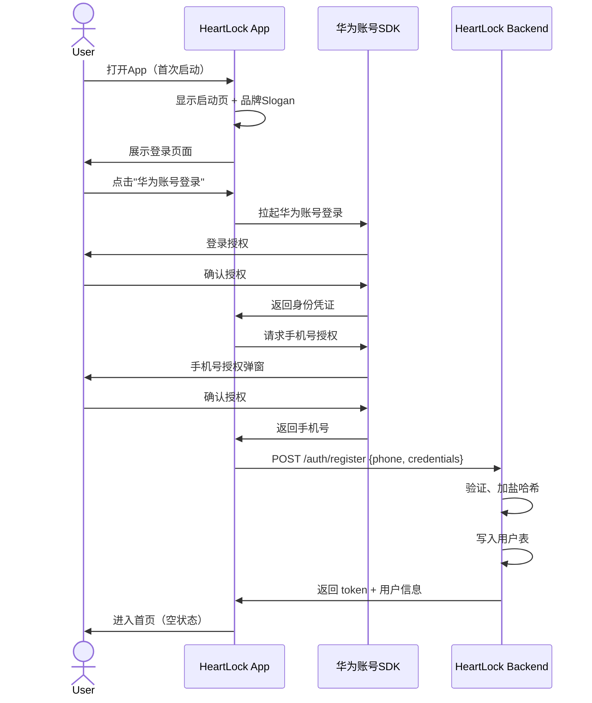
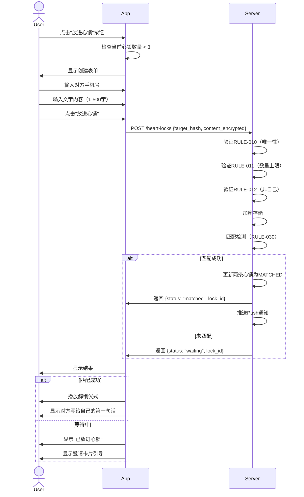
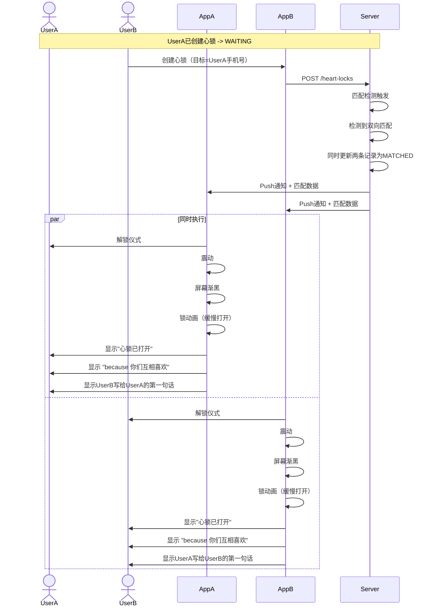
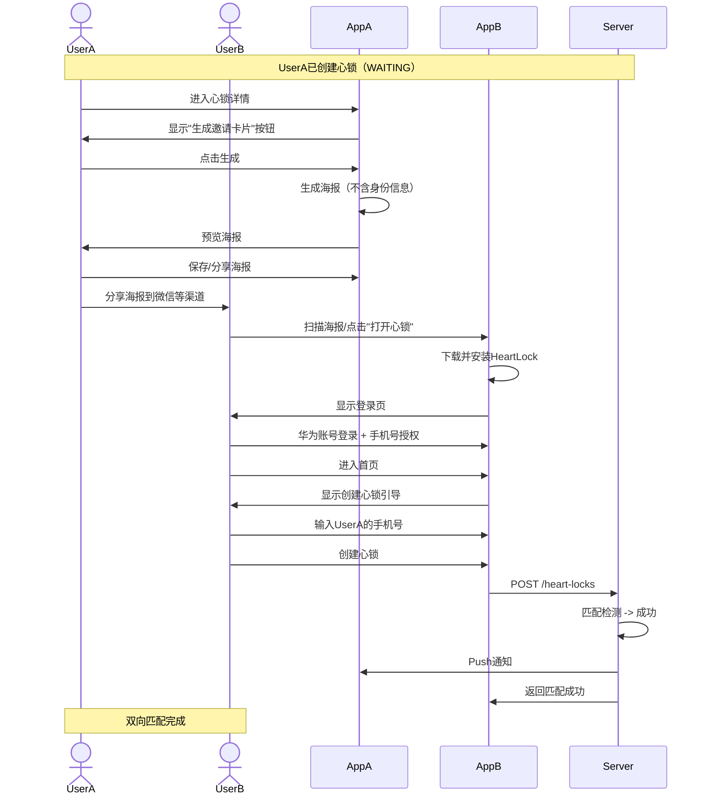
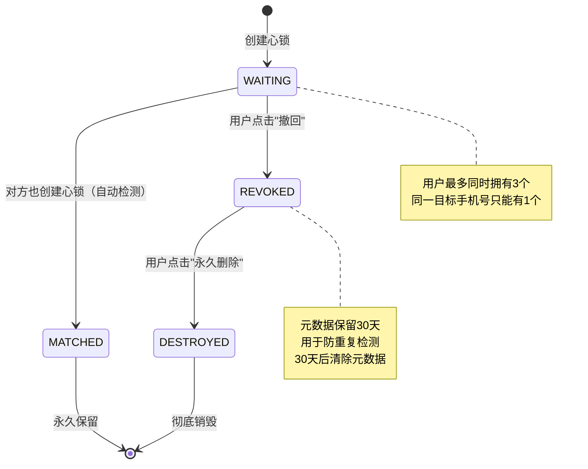
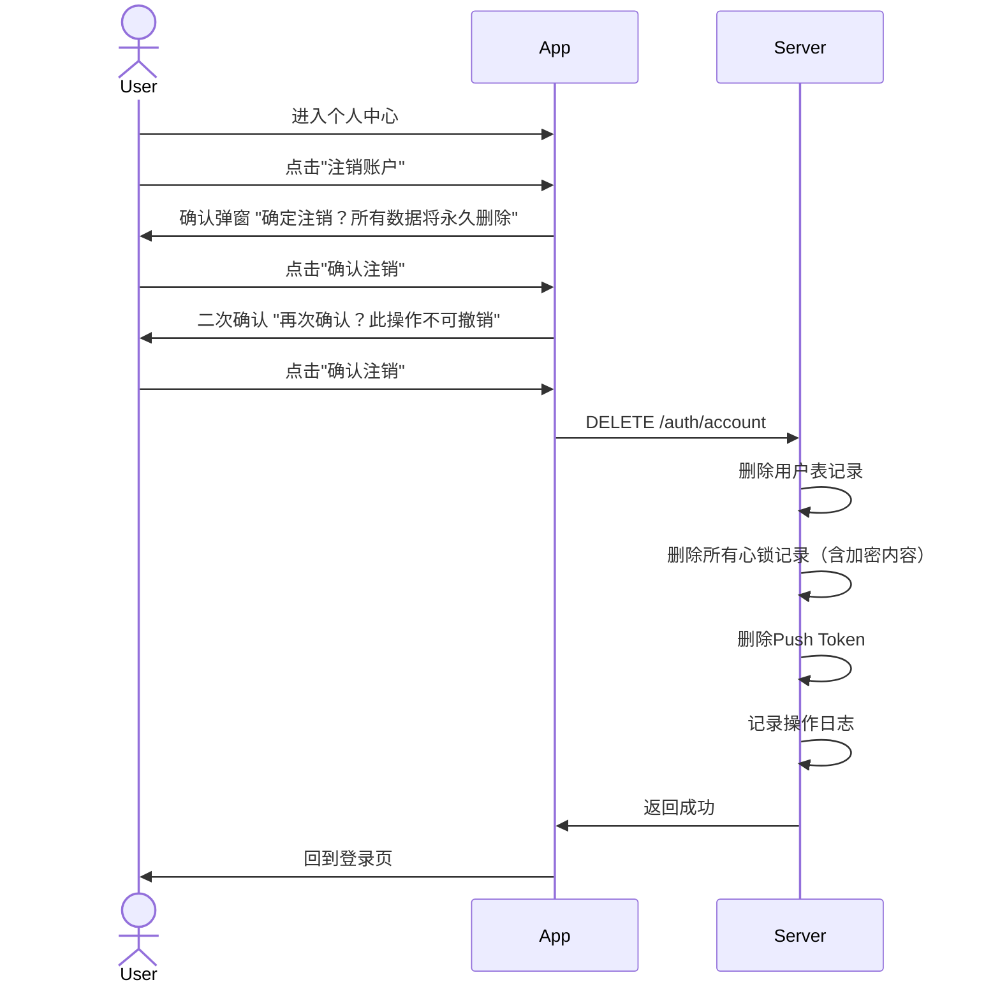
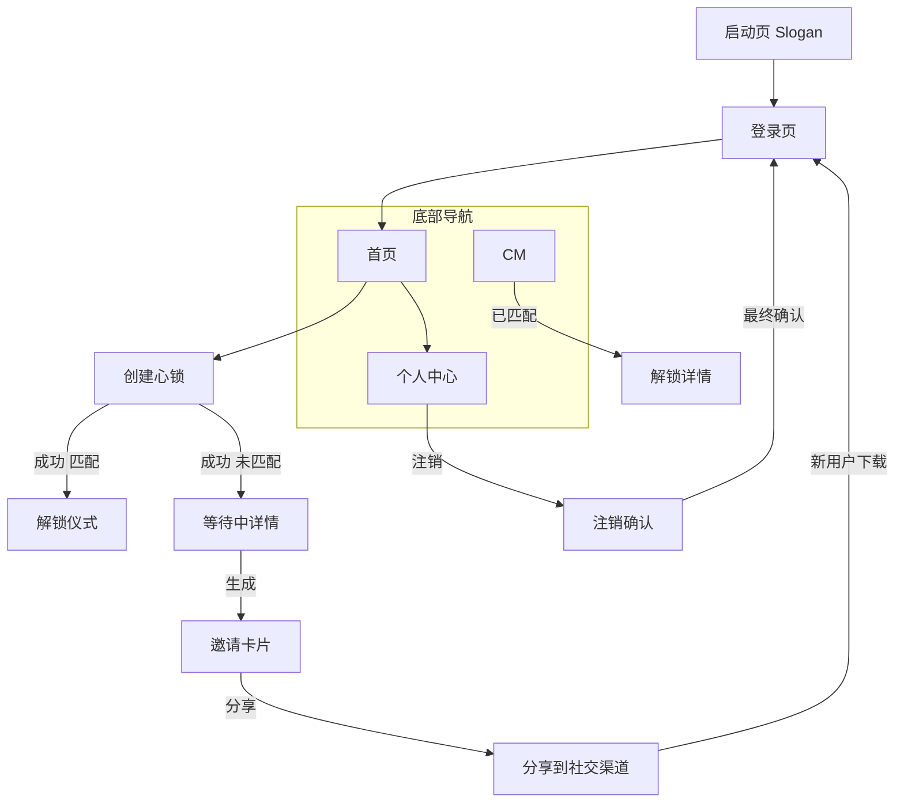

# 文档信息

| 字段 | 内容 |
|---|---|
| 文档名称 | HeartLock（心锁）用户流程 |
| 文档编号 | UF-V1.0 |
| 状态 | 草稿 |
| 作者 | Codex |
| 创建日期 | 2026-07-07 |
| 最后更新 | 2026-07-07 |

---

## 1. Purpose（目的）

本文档定义 HeartLock（心锁）所有核心用户操作的完整流程，包括页面流转、状态变化和分支条件，为设计和开发提供统一的流程参考。

---

## 2. Scope（范围）

涵盖首次使用流程、心锁创建流程、匹配解锁流程、邀请裂变流程和账户注销流程。

---

## 3. Sequence Diagrams（时序图）

### 3.1 首次使用 & 登录流程

### 3.2 创建心锁流程

### 3.3 匹配解锁仪式

### 3.4 邀请裂变流程

### 3.5 心锁管理流程

### 3.6 账户注销流程

---

## 4. Screen Flow（页面流程图）

---

## 5. References（引用）

| 引用 | 说明 |
|---|---|
| [PRD.md](./PRD.md) | 产品需求文档 |
| [BusinessRules.md](./BusinessRules.md) | 业务规则 |
| [API.md](../backend/API.md) | API 接口 |
